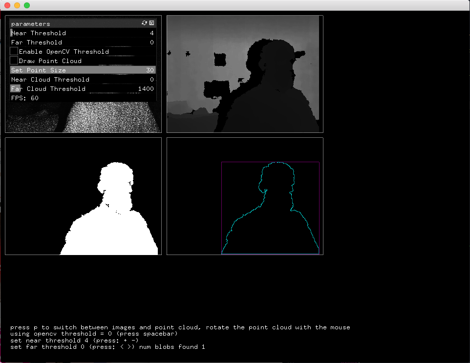
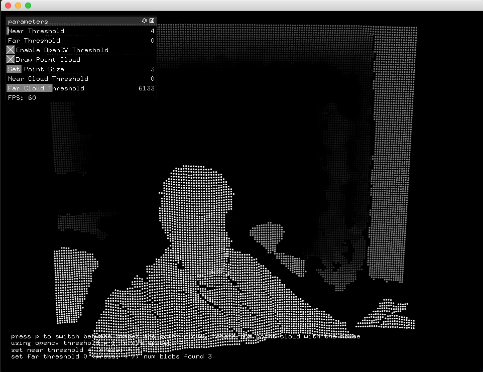
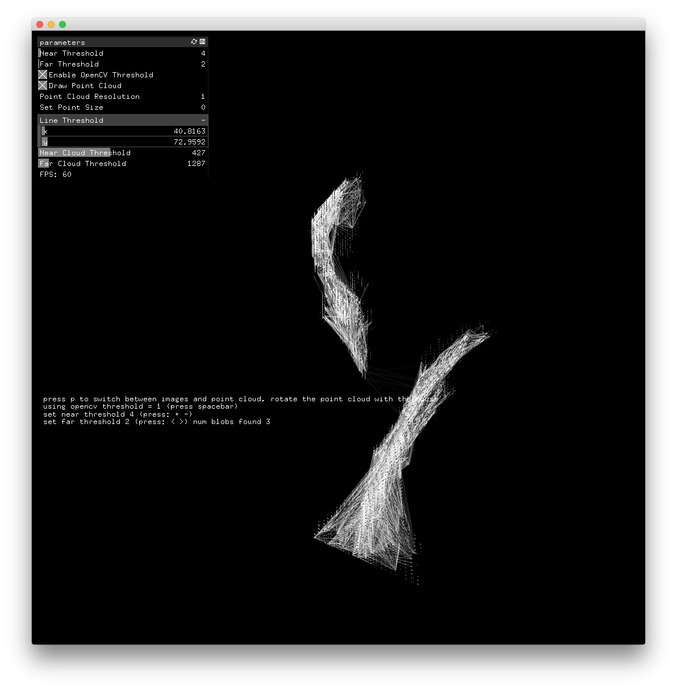
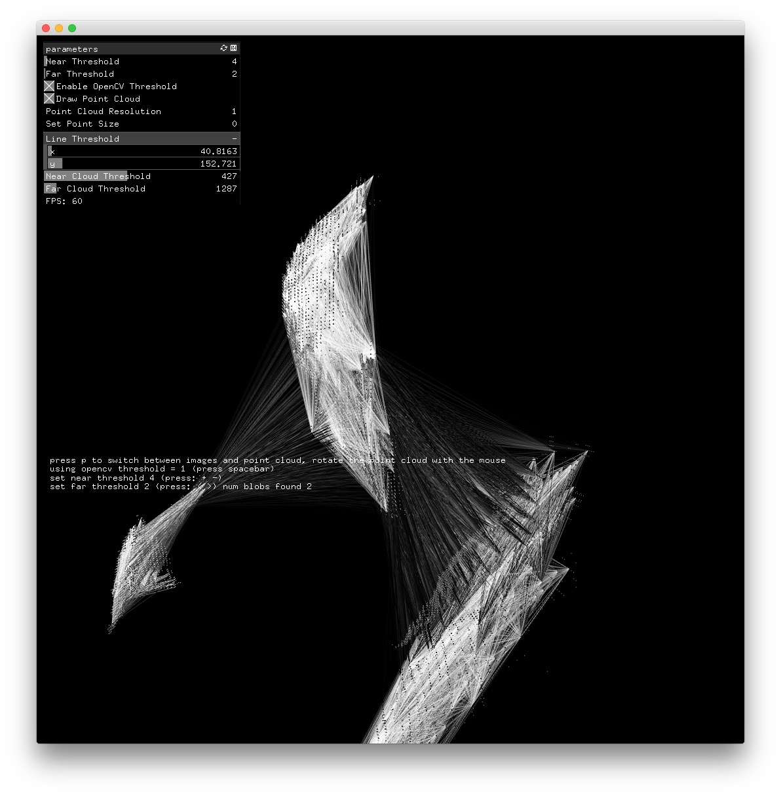

# example_openNI2Cloud
 needs my fork of -> [ofxNI2](https://github.com/alptugan/ofxNI2)
 
 Working Setup;
- OS : High Sierra 10.13.6
- oF : v.0.11
- GL version : (2,1)

Fixed the addon for ASUS Xtion Sensor to run with oF v.0.11.0. Cannot make run the example-assimp-model & example-user-tracker projects.

** Cannot make it run with Kinect v.01! **

Cloud view screen shot

** Example project ** 

OSX
--------

Add to Run Script

	cp -R ../../../addons/ofxNI2/libs/OpenNI2/lib/osx/ "$TARGET_BUILD_DIR/$PRODUCT_NAME.app/Contents/MacOS/";
	cp -R ../../../addons/ofxNI2/libs/NiTE2/lib/osx/ "$TARGET_BUILD_DIR/$PRODUCT_NAME.app/Contents/MacOS/";

Uncomment

    //#define HAVE_NITE2

in `ofxNI2.h` to use NiTE2.
